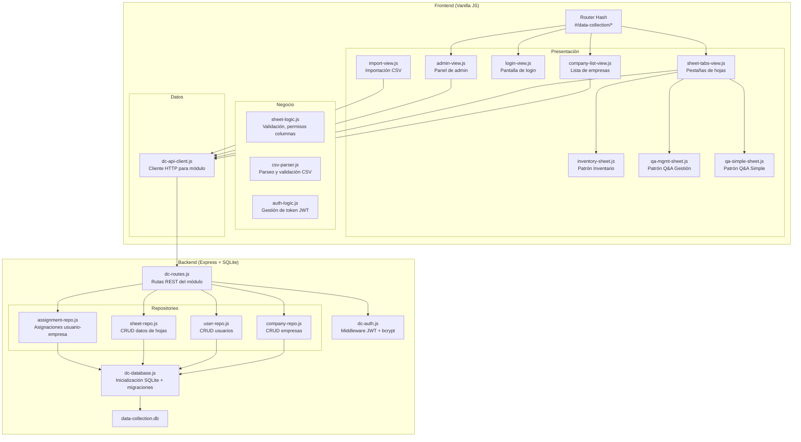
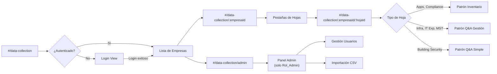
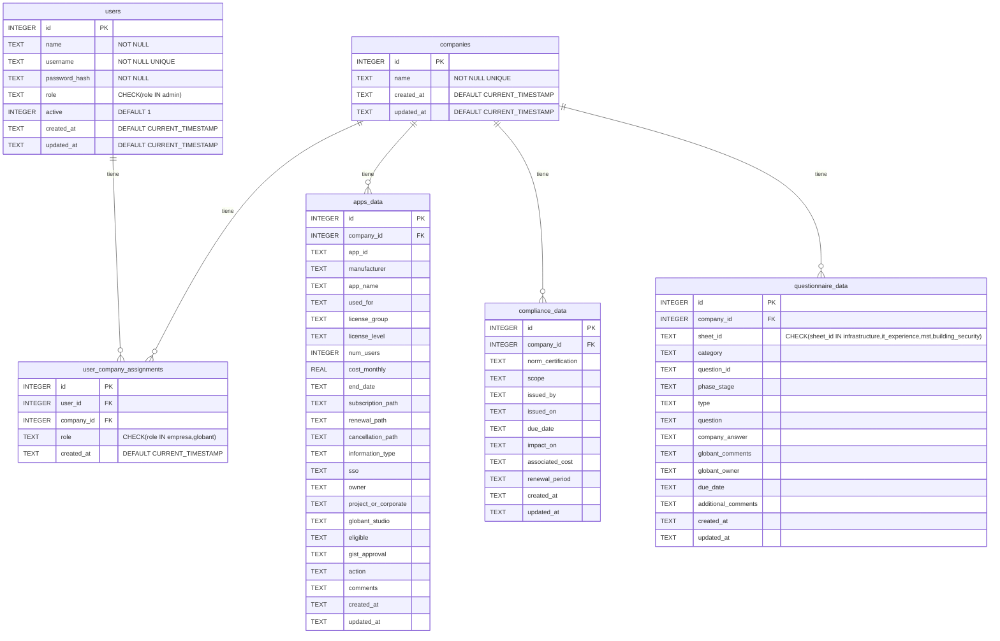

# Documento de Diseño — Módulo de Recolección de Datos

## Visión General

El Módulo de Recolección de Datos extiende el I4G Integration Tracker existente para reemplazar los Google Sheets utilizados en la recopilación de datos de integración por empresa. El diseño se integra con la arquitectura existente: el servidor Express en `proxy/server.js` se extiende con rutas REST y una base de datos SQLite (better-sqlite3), mientras que el frontend sigue la arquitectura de 3 capas (Datos/Negocio/Presentación) con Vanilla JS, reutilizando los tokens CSS, componentes y el router hash existentes.

### Decisiones Clave de Diseño

1. **SQLite con better-sqlite3**: Librería síncrona que simplifica las transacciones atómicas y evita la complejidad de drivers async. Se integra directamente en el proceso Express existente.
2. **JWT con jsonwebtoken + bcrypt**: Autenticación stateless que no interfiere con la autenticación OAuth de Jira existente. Los endpoints del módulo usan un middleware JWT separado.
3. **Patrón Repository**: Capa de acceso a datos que encapsula las queries SQLite, facilitando testing y mantenimiento.
4. **Extensión del router hash**: Se agregan rutas `#/data-collection/*` al router existente sin modificar las rutas actuales.
5. **Renderizado por patrón**: Tres funciones de renderizado reutilizables (inventario, cuestionario con gestión, cuestionario simple) que comparten la misma base de componentes.

## Arquitectura

### Diagrama de Arquitectura General



### Diagrama de Flujo de Navegación



## Componentes e Interfaces

### Backend

#### `proxy/dc-database.js` — Inicialización de Base de Datos

```javascript
/**
 * Inicializa la conexión SQLite y crea el esquema si no existe.
 * @returns {Database} Instancia de better-sqlite3
 */
function initDatabase(dbPath = './data-collection.db') { ... }

/**
 * Ejecuta la migración inicial: crea todas las tablas y el usuario admin por defecto.
 * @param {Database} db
 */
function runMigrations(db) { ... }
```

#### `proxy/dc-auth.js` — Autenticación JWT + bcrypt

```javascript
/**
 * Genera un JWT para un usuario autenticado.
 * @param {{ id, username, role }} user
 * @returns {string} Token JWT
 */
function generateToken(user) { ... }

/**
 * Middleware Express que valida el JWT y adjunta req.user.
 * Retorna 401 si el token es inválido/expirado.
 */
function authMiddleware(req, res, next) { ... }

/**
 * Middleware que verifica que el usuario tenga Rol_Admin.
 */
function adminOnly(req, res, next) { ... }

/**
 * Hashea una contraseña con bcrypt.
 * @param {string} password
 * @returns {string} Hash bcrypt
 */
function hashPassword(password) { ... }

/**
 * Verifica una contraseña contra un hash bcrypt.
 * @param {string} password
 * @param {string} hash
 * @returns {boolean}
 */
function verifyPassword(password, hash) { ... }
```

#### `proxy/dc-routes.js` — Rutas REST

Todas las respuestas siguen el formato `{ ok: true, data: ... }` o `{ ok: false, error: "mensaje" }`.

| Método | Ruta | Auth | Descripción |
|--------|------|------|-------------|
| POST | `/dc/auth/login` | No | Login, retorna JWT |
| GET | `/dc/companies` | JWT | Listar empresas (filtradas por asignación del usuario) |
| GET | `/dc/companies/:id` | JWT | Obtener empresa por ID |
| POST | `/dc/companies` | Admin | Crear empresa |
| PUT | `/dc/companies/:id` | Admin | Actualizar empresa |
| DELETE | `/dc/companies/:id` | Admin | Eliminar empresa |
| GET | `/dc/companies/:companyId/sheets/:sheetId` | JWT | Obtener datos de una hoja |
| PUT | `/dc/companies/:companyId/sheets/:sheetId/rows/:rowId` | JWT | Actualizar fila |
| POST | `/dc/companies/:companyId/sheets/:sheetId/rows` | JWT | Agregar fila |
| DELETE | `/dc/companies/:companyId/sheets/:sheetId/rows/:rowId` | JWT | Eliminar fila |
| GET | `/dc/users` | Admin | Listar usuarios |
| GET | `/dc/users/:id` | Admin | Obtener usuario |
| POST | `/dc/users` | Admin | Crear usuario |
| PUT | `/dc/users/:id` | Admin | Actualizar usuario |
| GET | `/dc/users/:userId/assignments` | Admin | Listar asignaciones de un usuario |
| GET | `/dc/companies/:companyId/assignments` | Admin | Listar asignaciones de una empresa |
| POST | `/dc/assignments` | Admin | Crear asignación usuario-empresa |
| DELETE | `/dc/assignments/:id` | Admin | Eliminar asignación |
| POST | `/dc/import/:companyId/:sheetId` | Admin | Importar CSV |
| GET | `/dc/export/:companyId/:sheetId` | JWT | Exportar datos como CSV |

#### Repositories (`proxy/dc-*-repo.js`)

Cada repository encapsula las operaciones SQL para una entidad. Usan transacciones de better-sqlite3 (`db.transaction(...)`) para operaciones de escritura.

```javascript
// company-repo.js
function findAll(db) { ... }
function findById(db, id) { ... }
function findByUserId(db, userId) { ... }  // empresas asignadas al usuario
function create(db, { name }) { ... }
function update(db, id, { name }) { ... }
function remove(db, id) { ... }

// user-repo.js
function findAll(db) { ... }
function findById(db, id) { ... }
function findByUsername(db, username) { ... }
function create(db, { name, username, passwordHash }) { ... }
function update(db, id, { name, active }) { ... }
function resetPassword(db, id, passwordHash) { ... }

// assignment-repo.js
function findByUser(db, userId) { ... }
function findByCompany(db, companyId) { ... }
function create(db, { userId, companyId, role }) { ... }
function remove(db, id) { ... }

// sheet-repo.js
function getSheetData(db, companyId, sheetId) { ... }
function getRow(db, companyId, sheetId, rowId) { ... }
function addRow(db, companyId, sheetId, data) { ... }
function updateRow(db, companyId, sheetId, rowId, data) { ... }
function deleteRow(db, companyId, sheetId, rowId) { ... }
function bulkInsert(db, companyId, sheetId, rows) { ... }  // para importación CSV
function exportRows(db, companyId, sheetId) { ... }  // para exportación CSV
```

### Frontend

#### `js/data/dc-api-client.js` — Cliente HTTP del Módulo

```javascript
/**
 * Login con credenciales, almacena el JWT en localStorage.
 * @param {string} username
 * @param {string} password
 * @returns {Promise<{ ok: boolean, user?: object, error?: string }>}
 */
export async function login(username, password) { ... }

/** Elimina el JWT de localStorage. */
export function logout() { ... }

/** Retorna el usuario decodificado del JWT o null. */
export function getCurrentUser() { ... }

/** Verifica si hay un JWT válido (no expirado). */
export function isAuthenticated() { ... }

// Funciones CRUD que adjuntan el JWT como Authorization: Bearer header
export async function fetchCompanies() { ... }
export async function fetchSheetData(companyId, sheetId) { ... }
export async function updateRow(companyId, sheetId, rowId, data) { ... }
export async function addRow(companyId, sheetId, data) { ... }
export async function deleteRow(companyId, sheetId, rowId) { ... }
export async function importCSV(companyId, sheetId, file) { ... }
// ... etc
```

#### `js/business/sheet-logic.js` — Lógica de Negocio de Hojas

```javascript
/** Definición de columnas por tipo de hoja y grupo (empresa/globant). */
export const SHEET_DEFINITIONS = { ... };

/**
 * Determina qué columnas son editables para un usuario dado su rol y empresa.
 * @param {string} sheetId - ID de la hoja
 * @param {string} userRole - 'empresa' | 'globant' | 'admin'
 * @returns {{ editable: string[], readOnly: string[] }}
 */
export function getEditableColumns(sheetId, userRole) { ... }

/**
 * Valida que los datos de una fila cumplan con la estructura de la hoja.
 * @param {string} sheetId
 * @param {object} rowData
 * @returns {{ valid: boolean, errors: string[] }}
 */
export function validateRowData(sheetId, rowData) { ... }
```

#### `js/business/csv-parser.js` — Parseo CSV

```javascript
/**
 * Parsea un string CSV en un array de objetos.
 * @param {string} csvText
 * @returns {{ headers: string[], rows: object[] }}
 */
export function parseCSV(csvText) { ... }

/**
 * Serializa un array de objetos a string CSV.
 * @param {string[]} headers
 * @param {object[]} rows
 * @returns {string}
 */
export function toCSV(headers, rows) { ... }

/**
 * Valida que las columnas del CSV coincidan con la estructura esperada de la hoja.
 * @param {string[]} csvHeaders
 * @param {string} sheetId
 * @returns {{ valid: boolean, unrecognized: string[], missing: string[] }}
 */
export function validateCSVHeaders(csvHeaders, sheetId) { ... }
```

#### Vistas de Presentación

Las vistas siguen el patrón existente: funciones que reciben un contenedor DOM y renderizan elementos usando `document.createElement`, reutilizando los componentes de `js/presentation/components.js`.

- **`js/presentation/dc/login-view.js`**: Formulario de login con username/password.
- **`js/presentation/dc/company-list-view.js`**: Lista de empresas como cards clickeables.
- **`js/presentation/dc/sheet-tabs-view.js`**: Contenedor con pestañas para las 6 hojas.
- **`js/presentation/dc/inventory-sheet.js`**: Tabla editable para Apps y Compliance.
- **`js/presentation/dc/qa-mgmt-sheet.js`**: Cuestionario agrupado por categoría con columnas de gestión.
- **`js/presentation/dc/qa-simple-sheet.js`**: Cuestionario agrupado por sección sin columnas de gestión.
- **`js/presentation/dc/admin-view.js`**: Panel de gestión de usuarios y asignaciones.
- **`js/presentation/dc/import-view.js`**: Interfaz de importación CSV.


## Modelos de Datos

### Esquema SQLite



### Decisiones del Modelo de Datos

1. **Tabla unificada `questionnaire_data`**: Las hojas Infrastructure, IT Experience, MST y Building Security comparten la misma estructura base (pregunta + respuesta). Se usa un campo `sheet_id` para diferenciarlas. Building Security simplemente no usa los campos `globant_comments`, `globant_owner`, `due_date` y `additional_comments` (quedan NULL).

2. **Tablas separadas para inventarios**: Apps y Compliance tienen estructuras de columnas muy diferentes entre sí, por lo que cada una tiene su propia tabla.

3. **Rol global vs rol por empresa**: El campo `role` en `users` solo almacena `'admin'` o `NULL`. Los roles `empresa`/`globant` se definen por asignación en `user_company_assignments`. Un usuario puede ser `empresa` en una compañía y `globant` en otra.

4. **Timestamps automáticos**: Todas las tablas de datos incluyen `created_at` y `updated_at` para auditoría, usando triggers SQLite para actualizar `updated_at` automáticamente.

### SQL de Creación del Esquema

```sql
CREATE TABLE IF NOT EXISTS companies (
    id INTEGER PRIMARY KEY AUTOINCREMENT,
    name TEXT NOT NULL UNIQUE,
    created_at TEXT DEFAULT (datetime('now')),
    updated_at TEXT DEFAULT (datetime('now'))
);

CREATE TABLE IF NOT EXISTS users (
    id INTEGER PRIMARY KEY AUTOINCREMENT,
    name TEXT NOT NULL,
    username TEXT NOT NULL UNIQUE,
    password_hash TEXT NOT NULL,
    role TEXT CHECK(role IN ('admin')) DEFAULT NULL,
    active INTEGER DEFAULT 1 CHECK(active IN (0, 1)),
    created_at TEXT DEFAULT (datetime('now')),
    updated_at TEXT DEFAULT (datetime('now'))
);

CREATE TABLE IF NOT EXISTS user_company_assignments (
    id INTEGER PRIMARY KEY AUTOINCREMENT,
    user_id INTEGER NOT NULL REFERENCES users(id) ON DELETE CASCADE,
    company_id INTEGER NOT NULL REFERENCES companies(id) ON DELETE CASCADE,
    role TEXT NOT NULL CHECK(role IN ('empresa', 'globant')),
    created_at TEXT DEFAULT (datetime('now')),
    UNIQUE(user_id, company_id, role)
);

CREATE TABLE IF NOT EXISTS apps_data (
    id INTEGER PRIMARY KEY AUTOINCREMENT,
    company_id INTEGER NOT NULL REFERENCES companies(id) ON DELETE CASCADE,
    app_id TEXT,
    manufacturer TEXT,
    app_name TEXT,
    used_for TEXT,
    license_group TEXT,
    license_level TEXT,
    num_users INTEGER,
    cost_monthly REAL,
    end_date TEXT,
    subscription_path TEXT,
    renewal_path TEXT,
    cancellation_path TEXT,
    information_type TEXT CHECK(information_type IN ('Public', 'Confidential', 'Sensitive', 'High Sensitive') OR information_type IS NULL),
    sso TEXT CHECK(sso IN ('Yes', 'No') OR sso IS NULL),
    owner TEXT,
    project_or_corporate TEXT,
    globant_studio TEXT,
    eligible TEXT CHECK(eligible IN ('Y', 'N') OR eligible IS NULL),
    gist_approval TEXT,
    action TEXT,
    comments TEXT,
    created_at TEXT DEFAULT (datetime('now')),
    updated_at TEXT DEFAULT (datetime('now'))
);

CREATE TABLE IF NOT EXISTS compliance_data (
    id INTEGER PRIMARY KEY AUTOINCREMENT,
    company_id INTEGER NOT NULL REFERENCES companies(id) ON DELETE CASCADE,
    norm_certification TEXT,
    scope TEXT,
    issued_by TEXT,
    issued_on TEXT,
    due_date TEXT,
    impact_on TEXT,
    associated_cost TEXT,
    renewal_period TEXT,
    created_at TEXT DEFAULT (datetime('now')),
    updated_at TEXT DEFAULT (datetime('now'))
);

CREATE TABLE IF NOT EXISTS questionnaire_data (
    id INTEGER PRIMARY KEY AUTOINCREMENT,
    company_id INTEGER NOT NULL REFERENCES companies(id) ON DELETE CASCADE,
    sheet_id TEXT NOT NULL CHECK(sheet_id IN ('infrastructure', 'it_experience', 'mst', 'building_security')),
    category TEXT,
    question_id TEXT,
    phase_stage TEXT,
    type TEXT,
    question TEXT NOT NULL,
    company_answer TEXT,
    globant_comments TEXT,
    globant_owner TEXT,
    due_date TEXT,
    additional_comments TEXT,
    created_at TEXT DEFAULT (datetime('now')),
    updated_at TEXT DEFAULT (datetime('now'))
);

-- Triggers para updated_at automático
CREATE TRIGGER IF NOT EXISTS trg_companies_updated AFTER UPDATE ON companies
BEGIN UPDATE companies SET updated_at = datetime('now') WHERE id = NEW.id; END;

CREATE TRIGGER IF NOT EXISTS trg_users_updated AFTER UPDATE ON users
BEGIN UPDATE users SET updated_at = datetime('now') WHERE id = NEW.id; END;

CREATE TRIGGER IF NOT EXISTS trg_apps_updated AFTER UPDATE ON apps_data
BEGIN UPDATE apps_data SET updated_at = datetime('now') WHERE id = NEW.id; END;

CREATE TRIGGER IF NOT EXISTS trg_compliance_updated AFTER UPDATE ON compliance_data
BEGIN UPDATE compliance_data SET updated_at = datetime('now') WHERE id = NEW.id; END;

CREATE TRIGGER IF NOT EXISTS trg_questionnaire_updated AFTER UPDATE ON questionnaire_data
BEGIN UPDATE questionnaire_data SET updated_at = datetime('now') WHERE id = NEW.id; END;
```

### Formato de Respuesta API

Todas las respuestas siguen una estructura consistente:

```javascript
// Éxito
{ "ok": true, "data": { ... } }

// Éxito con lista
{ "ok": true, "data": [ ... ] }

// Error
{ "ok": false, "error": "Descripción del error" }

// Error de validación
{ "ok": false, "error": "Campos requeridos faltantes", "fields": ["name", "username"] }
```

### Mapeo de Columnas por Rol

| Hoja | Columnas_Empresa | Columnas_Globant |
|------|-----------------|------------------|
| Apps | app_id, manufacturer, app_name, used_for, license_group, license_level, num_users, cost_monthly, end_date, subscription_path, renewal_path, cancellation_path, information_type, sso, owner, project_or_corporate | globant_studio, eligible, gist_approval, action, comments |
| Compliance | Todas las columnas (norm_certification, scope, issued_by, issued_on, due_date, impact_on, associated_cost, renewal_period) | Ninguna |
| Infrastructure, IT Exp, MST | company_answer | globant_comments, globant_owner, due_date, additional_comments |
| Building Security | company_answer | Ninguna |


## Propiedades de Correctitud

*Una propiedad es una característica o comportamiento que debe mantenerse verdadero en todas las ejecuciones válidas de un sistema — esencialmente, una declaración formal sobre lo que el sistema debe hacer. Las propiedades sirven como puente entre especificaciones legibles por humanos y garantías de correctitud verificables por máquina.*

### Property 1: CRUD Round-Trip

*For any* entidad válida (empresa, usuario, fila de hoja), crearla mediante la API y luego obtenerla por ID inmediatamente después debe retornar una entidad con datos equivalentes a los enviados en la creación.

**Validates: Requirements 1.3, 3.2, 3.7, 11.1, 11.2, 11.4, 11.8**

### Property 2: JWT Login Produce Token Válido con Claims Correctos

*For any* usuario registrado con credenciales válidas, el endpoint de login debe retornar un JWT que, al decodificarse, contenga el ID del usuario, su rol, y una fecha de expiración futura.

**Validates: Requirements 2.1, 2.2**

### Property 3: Credenciales Inválidas Retornan 401 Genérico

*For any* combinación de username y password donde el username no existe o el password es incorrecto, el endpoint de login debe retornar HTTP 401 con un mensaje que no revele si el usuario existe o no (el mensaje debe ser idéntico en ambos casos).

**Validates: Requirements 2.3**

### Property 4: Token JWT Inválido o Expirado Rechazado con 401

*For any* petición a un endpoint protegido con un JWT malformado, con firma inválida, o expirado, la API debe retornar HTTP 401.

**Validates: Requirements 2.4, 2.5**

### Property 5: Hashing de Contraseñas Round-Trip

*For any* contraseña en texto plano, hashearla con bcrypt y luego verificar la contraseña original contra el hash debe retornar `true`, y verificar cualquier otra contraseña diferente debe retornar `false`.

**Validates: Requirements 2.6**

### Property 6: Usuarios Desactivados Rechazados con 403

*For any* usuario que ha sido marcado como inactivo, cualquier petición autenticada con su JWT válido debe ser rechazada con HTTP 403.

**Validates: Requirements 3.3**

### Property 7: Asignaciones Muchos-a-Muchos

*For any* conjunto de usuarios y empresas, debe ser posible crear múltiples asignaciones de un mismo usuario a diferentes empresas con roles independientes, y múltiples usuarios a una misma empresa, y cada asignación debe ser recuperable correctamente.

**Validates: Requirements 3.4, 3.5, 3.6, 11.3**

### Property 8: Columnas Editables por Rol

*For any* combinación de tipo de hoja y rol de usuario (empresa, globant, admin), la función `getEditableColumns` debe retornar exactamente el conjunto de columnas correspondiente: Columnas_Empresa para Rol_Empresa, Columnas_Globant para Rol_Globant, y todas las columnas para Rol_Admin.

**Validates: Requirements 4.1, 4.2, 4.4**

### Property 9: Escritura No Autorizada Rechazada sin Cambios Parciales

*For any* petición de escritura donde el usuario no tiene el rol adecuado para las columnas que intenta modificar, o no está asignado a la empresa, la API debe rechazar con HTTP 403 y el estado de la base de datos debe permanecer sin cambios.

**Validates: Requirements 4.3, 4.5, 4.6**

### Property 10: Lista de Empresas Filtrada por Asignaciones del Usuario

*For any* usuario con asignaciones a un subconjunto de empresas, el endpoint de listar empresas debe retornar exactamente las empresas asignadas. Para un usuario con Rol_Admin, debe retornar todas las empresas del sistema.

**Validates: Requirements 5.2, 5.6**

### Property 11: Mapeo Hoja-a-Patrón de Renderizado

*For any* ID de hoja válido, el sistema debe seleccionar el patrón de renderizado correcto: Patrón_Inventario para "apps" y "compliance", Patrón_Cuestionario_Gestión para "infrastructure", "it_experience" y "mst", y Patrón_Cuestionario_Simple para "building_security".

**Validates: Requirements 5.4**

### Property 12: Edición de Celda Round-Trip

*For any* hoja, fila existente y valor nuevo válido para una columna editable, actualizar la celda y luego obtener la fila debe retornar el valor actualizado.

**Validates: Requirements 6.3, 7.3, 7.4, 8.3**

### Property 13: Agregar Fila Incrementa Conteo, Eliminar Fila Decrementa Conteo

*For any* hoja de tipo inventario con N filas, agregar una fila válida debe resultar en N+1 filas, y eliminar una fila existente debe resultar en N-1 filas.

**Validates: Requirements 6.4, 6.5**

### Property 14: Agrupación de Cuestionarios por Categoría/Sección

*For any* conjunto de datos de cuestionario con categorías o secciones asignadas, la función de agrupación debe producir grupos donde cada pregunta aparece exactamente una vez y en el grupo correspondiente a su categoría/sección.

**Validates: Requirements 7.1, 8.1**

### Property 15: Building Security Excluye Columnas de Gestión

*For any* dato de la hoja Building Security, las columnas de gestión Globant (globant_owner, due_date, additional_comments) no deben aparecer en la vista renderizada.

**Validates: Requirements 8.4**

### Property 16: Validación de Headers CSV

*For any* conjunto de headers CSV y un ID de hoja destino, la función de validación debe identificar correctamente las columnas reconocidas, las no reconocidas y las faltantes, comparando contra la definición de columnas de la hoja.

**Validates: Requirements 9.2, 9.3**

### Property 17: Importación/Exportación CSV Round-Trip

*For any* datos CSV válidos para una hoja, importar los datos y luego exportarlos debe producir un CSV con contenido equivalente al original (mismas columnas, mismas filas, mismos valores).

**Validates: Requirements 9.7**

### Property 18: Transacciones Fallidas Revierten Completamente

*For any* operación de escritura o importación que falla a mitad de ejecución, el estado de la base de datos después del fallo debe ser idéntico al estado antes de la operación (sin cambios parciales).

**Validates: Requirements 1.4, 9.6**

### Property 19: Todos los Registros Tienen Timestamps Válidos

*For any* registro creado o actualizado en cualquier tabla de datos, los campos `created_at` y `updated_at` deben contener timestamps válidos en formato ISO, y `updated_at` debe ser mayor o igual a `created_at`.

**Validates: Requirements 1.6**

### Property 20: Respuestas API Siguen Formato JSON Consistente

*For any* respuesta de la API (éxito o error), el cuerpo JSON debe contener el campo `ok` (boolean), y si `ok` es `true` debe contener `data`, y si `ok` es `false` debe contener `error` (string).

**Validates: Requirements 11.6**

### Property 21: Campos Requeridos Faltantes Retornan 400 con Detalle

*For any* petición de creación o actualización con uno o más campos requeridos faltantes, la API debe retornar HTTP 400 con un mensaje que incluya la lista de campos faltantes.

**Validates: Requirements 11.7**

## Manejo de Errores

### Backend

| Escenario | Código HTTP | Respuesta |
|-----------|-------------|-----------|
| Credenciales inválidas | 401 | `{ ok: false, error: "Credenciales inválidas" }` |
| Token JWT inválido/expirado | 401 | `{ ok: false, error: "Token inválido o expirado" }` |
| Usuario inactivo | 403 | `{ ok: false, error: "Usuario desactivado" }` |
| Sin permiso para empresa | 403 | `{ ok: false, error: "Sin acceso a esta empresa" }` |
| Sin permiso para columnas | 403 | `{ ok: false, error: "Sin permiso para modificar estas columnas" }` |
| Campos requeridos faltantes | 400 | `{ ok: false, error: "Campos requeridos faltantes", fields: [...] }` |
| Entidad no encontrada | 404 | `{ ok: false, error: "Empresa no encontrada" }` |
| Username duplicado | 409 | `{ ok: false, error: "El nombre de usuario ya existe" }` |
| CSV con columnas inválidas | 400 | `{ ok: false, error: "Columnas no reconocidas", unrecognized: [...] }` |
| Error de transacción SQLite | 500 | `{ ok: false, error: "Error interno del servidor" }` |

### Frontend

- **Token expirado**: El `dc-api-client.js` detecta respuestas 401, limpia el JWT de localStorage y redirige a la vista de login.
- **Error de red**: Muestra el componente `createErrorState` existente con botón de reintentar.
- **Error de validación (400)**: Muestra los campos con error resaltados en el formulario.
- **Error de permisos (403)**: Muestra un mensaje informativo y deshabilita los controles de edición.

## Estrategia de Testing

### Enfoque Dual: Tests Unitarios + Tests de Propiedades

El módulo utiliza **Vitest** como framework de testing y **fast-check** para property-based testing, consistente con el setup existente del proyecto.

### Tests Unitarios

Los tests unitarios cubren ejemplos específicos, edge cases y condiciones de error:

- **Esquema SQLite**: Verificar que `initDatabase` crea todas las tablas esperadas (Req 1.2, 1.5)
- **Usuario admin por defecto**: Verificar que la migración inicial crea el usuario admin (Req 2.7)
- **Columnas de hojas específicas**: Verificar que Apps tiene las 21 columnas definidas, Compliance las 8, etc. (Req 6.1, 6.2, 7.2, 7.5, 7.6, 7.7, 8.2)
- **Navegación**: Verificar que la entrada "Recolección de Datos" aparece en el nav (Req 5.1)
- **Pestañas de hojas**: Verificar que se muestran exactamente 6 pestañas (Req 5.3)
- **Rutas existentes no afectadas**: Verificar que las rutas de Jira OAuth siguen funcionando (Req 10.5)
- **Building Security multi-oficina**: Verificar renderizado con múltiples columnas de respuesta (Req 8.5)

### Tests de Propiedades (Property-Based Testing)

Cada propiedad de correctitud se implementa como un **único test de propiedad** usando fast-check con mínimo 100 iteraciones. Cada test referencia la propiedad del documento de diseño.

**Librería**: `fast-check` (ya instalada en el proyecto, v4.1.1)

**Configuración**: Mínimo 100 iteraciones por test (`{ numRuns: 100 }`)

**Formato de tag en cada test**:
```javascript
// Feature: data-collection-module, Property 1: CRUD Round-Trip
```

**Tests de propiedades planificados**:

| Propiedad | Archivo de Test | Generadores Necesarios |
|-----------|----------------|----------------------|
| P1: CRUD Round-Trip | `tests/property/dc-crud.prop.js` | companyArb, userArb, sheetRowArb |
| P2: JWT Login Token Válido | `tests/property/dc-auth.prop.js` | userCredentialsArb |
| P3: Credenciales Inválidas → 401 | `tests/property/dc-auth.prop.js` | invalidCredentialsArb |
| P4: JWT Inválido → 401 | `tests/property/dc-auth.prop.js` | invalidTokenArb |
| P5: Password Hash Round-Trip | `tests/property/dc-auth.prop.js` | passwordArb |
| P6: Usuarios Desactivados → 403 | `tests/property/dc-auth.prop.js` | userArb |
| P7: Asignaciones M:N | `tests/property/dc-assignments.prop.js` | userArb, companyArb, roleArb |
| P8: Columnas Editables por Rol | `tests/property/dc-permissions.prop.js` | sheetIdArb, roleArb |
| P9: Escritura No Autorizada → 403 | `tests/property/dc-permissions.prop.js` | unauthorizedWriteArb |
| P10: Lista Empresas por Asignación | `tests/property/dc-permissions.prop.js` | userWithAssignmentsArb |
| P11: Mapeo Hoja-Patrón | `tests/property/dc-sheets.prop.js` | sheetIdArb |
| P12: Edición Celda Round-Trip | `tests/property/dc-sheets.prop.js` | sheetRowArb, cellEditArb |
| P13: Add/Delete Row Count | `tests/property/dc-sheets.prop.js` | inventoryRowArb |
| P14: Agrupación por Categoría | `tests/property/dc-sheets.prop.js` | questionnaireDataArb |
| P15: Building Security sin Gestión | `tests/property/dc-sheets.prop.js` | buildingSecurityRowArb |
| P16: Validación Headers CSV | `tests/property/dc-csv.prop.js` | csvHeadersArb, sheetIdArb |
| P17: CSV Import/Export Round-Trip | `tests/property/dc-csv.prop.js` | csvDataArb |
| P18: Rollback en Fallo | `tests/property/dc-transactions.prop.js` | failingWriteArb |
| P19: Timestamps Válidos | `tests/property/dc-crud.prop.js` | entityArb |
| P20: Formato JSON Consistente | `tests/property/dc-api.prop.js` | apiRequestArb |
| P21: Campos Faltantes → 400 | `tests/property/dc-api.prop.js` | incompleteEntityArb |

### Generadores Personalizados

Se extenderá el archivo `tests/property/generators.js` existente (o se creará `tests/property/dc-generators.js`) con generadores específicos del módulo:

```javascript
// Generadores principales para el módulo de recolección de datos
export const dcCompanyNameArb = fc.string({ minLength: 1, maxLength: 100 }).filter(s => s.trim().length > 0);
export const dcUsernameArb = fc.stringMatching(/^[a-zA-Z][a-zA-Z0-9_]{2,29}$/);
export const dcPasswordArb = fc.string({ minLength: 8, maxLength: 72 });
export const dcRoleArb = fc.constantFrom('empresa', 'globant');
export const dcSheetIdArb = fc.constantFrom('apps', 'compliance', 'infrastructure', 'it_experience', 'mst', 'building_security');
export const dcCategoryArb = fc.constantFrom('Company Overview', 'Devices', 'Architecture', 'ISP', 'Support Teams', ...);
export const dcAppsRowArb = fc.record({ ... }); // genera una fila válida de Apps
export const dcComplianceRowArb = fc.record({ ... }); // genera una fila válida de Compliance
export const dcQuestionnaireRowArb = fc.record({ ... }); // genera una fila válida de cuestionario
export const dcCSVArb = ...; // genera un string CSV válido para una hoja dada
```
