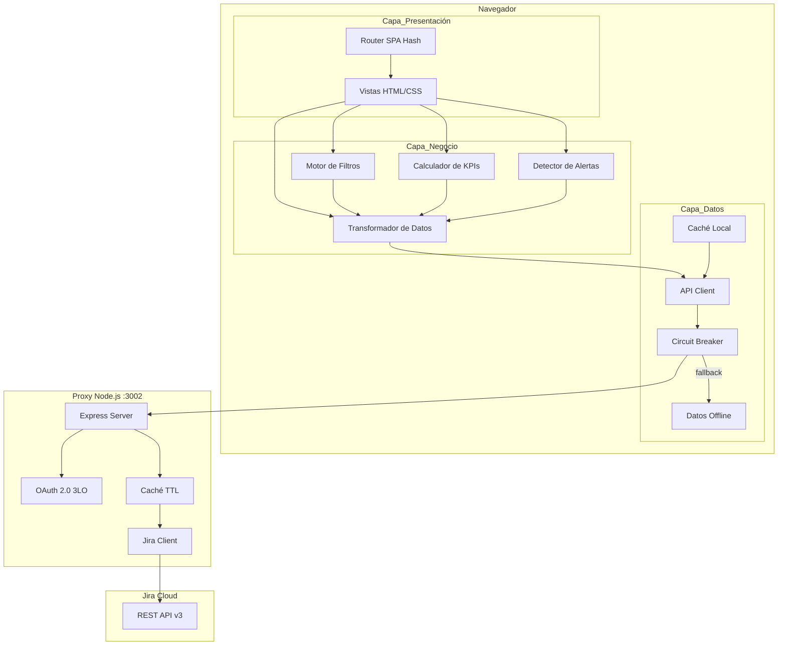
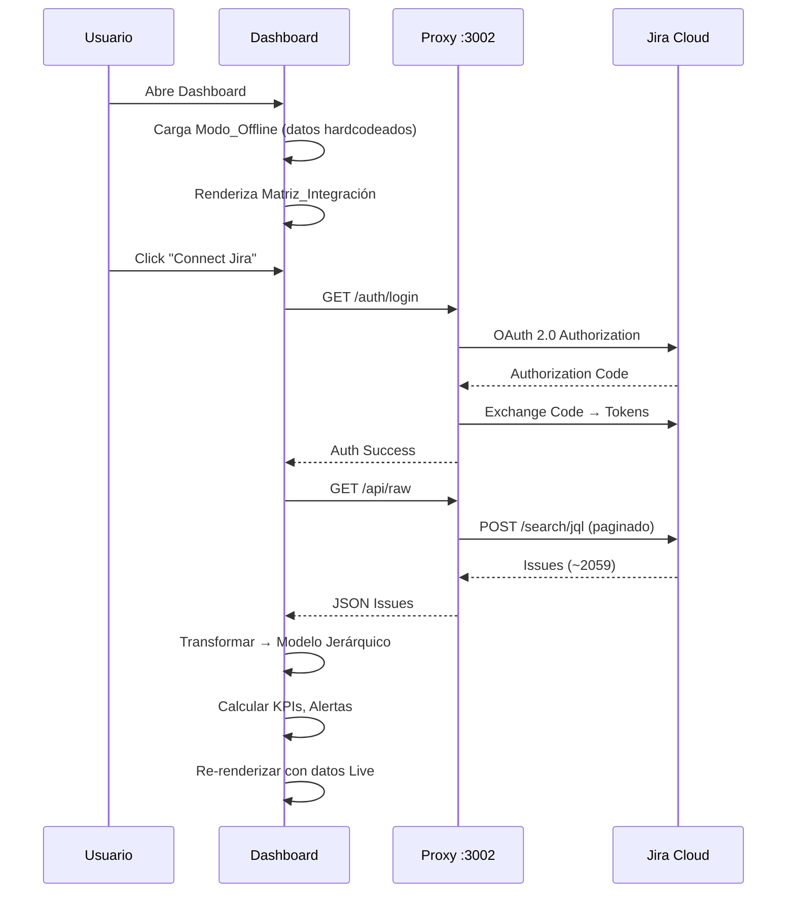
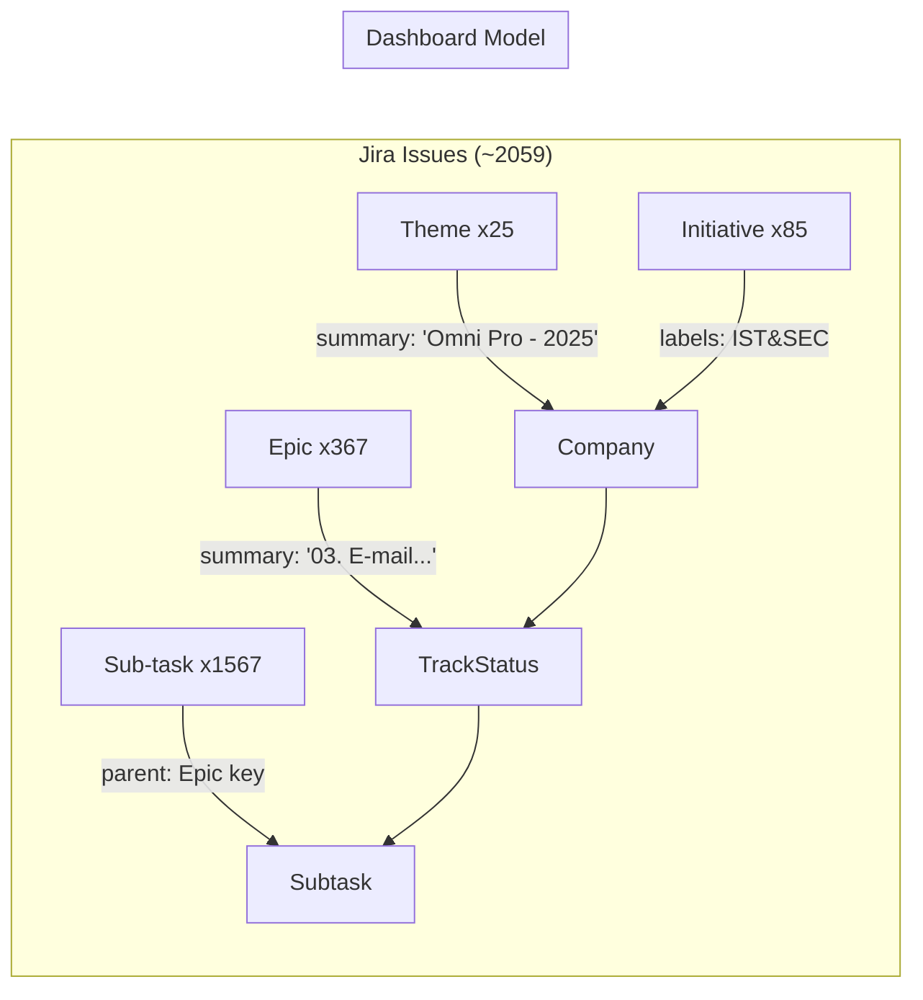

# Documento de Diseño — I4G Integration Tracker Dashboard

## Resumen (Overview)

El I4G Integration Tracker Dashboard es una aplicación web que permite al equipo I4G de Globant visualizar el estado de integración de ~25 empresas adquiridas a través de 14 tracks de integración. La arquitectura se compone de dos partes principales:

1. **Proxy Node.js (existente)**: Servidor Express en `proxy/` que maneja autenticación OAuth 2.0 (3LO) con Jira Cloud, caché de respuestas con TTL configurable, y endpoints REST (`/api/raw`, `/api/summary`, `/health`).
2. **Dashboard estático (nuevo)**: Aplicación HTML/CSS/JS vanilla que consume datos del Proxy, los transforma en un modelo jerárquico (Empresa → Track → Subtarea), y renderiza vistas interactivas.

El sistema opera en dos modos: **Live** (datos en tiempo real desde Jira vía Proxy en puerto 3002) y **Offline** (datos hardcodeados como fallback). La decisión de usar vanilla JS sin frameworks responde a la simplicidad del dominio y la necesidad de un bundle ligero con FCP < 3s.

### Decisiones de Diseño Clave

| Decisión | Justificación |
|----------|---------------|
| Vanilla JS (sin framework) | Bundle mínimo, FCP < 3s, dominio acotado (~2059 issues) |
| Arquitectura 3 capas en cliente | Separación Datos/Negocio/Presentación para testabilidad |
| Proxy existente sin modificaciones mayores | Ya resuelve OAuth, caché y paginación de Jira |
| CSS Custom Properties para tokens | Soporte nativo de modo oscuro y temas sin dependencias |
| Datos offline hardcodeados | Fallback inmediato sin dependencia de red |

## Arquitectura



### Flujo de Datos Principal



### Estructura de Archivos Propuesta

```
/
├── index.html                    # Entry point
├── css/
│   ├── tokens.css                # Design tokens (colores, tipografía, espaciado)
│   ├── base.css                  # Reset, tipografía base, utilidades
│   ├── components.css            # Estilos de componentes reutilizables
│   ├── layout.css                # Grid, header, navegación
│   ├── views.css                 # Estilos específicos por vista
│   ├── dark.css                  # Override tokens para modo oscuro
│   └── print.css                 # Hoja de impresión A4
├── js/
│   ├── data/
│   │   ├── api-client.js         # Comunicación con Proxy, retry, circuit breaker
│   │   ├── offline-data.js       # Datos hardcodeados de fallback
│   │   └── cache.js              # Caché local en memoria
│   ├── business/
│   │   ├── transformer.js        # Jira raw → Modelo jerárquico
│   │   ├── filters.js            # Lógica de filtrado (severidad, año, región, estado)
│   │   ├── kpis.js               # Cálculo de métricas y KPIs
│   │   └── alerts.js             # Detección de tracks demorados
│   ├── presentation/
│   │   ├── router.js             # Hash-based routing
│   │   ├── matrix-view.js        # Vista Matriz_Integración
│   │   ├── region-view.js        # Vista por Región
│   │   ├── detail-view.js        # Vista de Detalle por Empresa
│   │   ├── alerts-view.js        # Panel de Alertas
│   │   ├── kpi-panel.js          # Panel de KPIs y gráficos
│   │   ├── header.js             # Header con estado de conexión
│   │   └── components.js         # Componentes reutilizables (tooltip, badge, spinner, etc.)
│   └── app.js                    # Bootstrap, inicialización, event bus
├── proxy/                        # (existente, sin cambios mayores)
│   ├── server.js
│   ├── auth.js
│   ├── jira-client.js
│   └── package.json
└── docs/
    └── ...
```


## Componentes e Interfaces

### 1. Capa de Datos (`js/data/`)

#### `api-client.js` — Cliente HTTP con resiliencia

```javascript
// Interfaz pública
const ApiClient = {
  /** Inicia flujo OAuth abriendo ventana del Proxy */
  login(): void,

  /** Cierra sesión OAuth y limpia caché */
  logout(): Promise<void>,

  /** Verifica estado de autenticación */
  checkAuth(): Promise<{ authenticated: boolean }>,

  /** Obtiene issues crudos de Jira (con retry + circuit breaker) */
  fetchRawIssues(): Promise<JiraIssue[]>,

  /** Registra listener para cambios de estado de conexión */
  onConnectionChange(callback: (isLive: boolean) => void): void
};
```

**Circuit Breaker**: Se activa tras 5 fallos consecutivos. Cuando está abierto, retorna datos offline inmediatamente. Se resetea tras un período configurable (30s por defecto).

**Retry**: Máximo 3 intentos con backoff exponencial (1s, 2s, 4s).

#### `offline-data.js` — Datos de fallback

Exporta un array de objetos con la misma estructura que la respuesta de `/api/raw`, representando datos de ejemplo para ~5 empresas con tracks en distintos estados.

#### `cache.js` — Caché en memoria

```javascript
const Cache = {
  /** Almacena datos con timestamp */
  set(key: string, data: any): void,

  /** Obtiene datos si no han expirado */
  get(key: string, maxAgeMs: number): any | null,

  /** Limpia toda la caché */
  clear(): void
};
```

### 2. Capa de Negocio (`js/business/`)

#### `transformer.js` — Transformación Jira → Modelo

```javascript
/**
 * Transforma issues crudos de Jira en modelo jerárquico del Dashboard.
 * @param {JiraIssue[]} rawIssues - Issues crudos del endpoint /api/raw
 * @returns {DashboardModel} - Modelo estructurado
 */
function transformJiraData(rawIssues): DashboardModel;

/**
 * Extrae nombre y año de un summary de Theme.
 * Patrón esperado: "[Nombre] - [Año]"
 * @returns {{ name: string, year: number }}
 */
function parseCompanySummary(summary: string): { name: string, year: number };

/**
 * Mapea un summary de Epic al número de track (01-14).
 * Patrón esperado: "XX. [Nombre del Track]"
 * @returns {number | null} - Número de track o null si no coincide
 */
function parseTrackNumber(summary: string): number | null;

/**
 * Mapea un estado de Jira al estado simplificado del Dashboard.
 */
function mapJiraStatus(jiraStatus: string): DashboardStatus;

/**
 * Calcula el porcentaje de completitud de un track.
 * @returns {number} - 0 a 100
 */
function calculateTrackProgress(subtasks: Subtask[]): number;
```

#### `filters.js` — Motor de filtros

```javascript
/**
 * Aplica filtros con lógica AND sobre el modelo.
 * @param {DashboardModel} model - Modelo completo
 * @param {FilterState} filters - Estado actual de filtros
 * @returns {DashboardModel} - Modelo filtrado
 */
function applyFilters(model: DashboardModel, filters: FilterState): DashboardModel;

/**
 * Filtra empresas por año de adquisición.
 */
function filterByYear(companies: Company[], year: number | null): Company[];

/**
 * Filtra columnas de tracks por severidad.
 */
function filterBySeverity(tracks: Track[], severity: Severity | null): Track[];

/**
 * Filtra empresas por región.
 */
function filterByRegion(companies: Company[], region: Region | null): Company[];

/**
 * Filtra celdas por estado de completitud.
 */
function filterByStatus(companies: Company[], status: DashboardStatus | null): Company[];
```

#### `kpis.js` — Calculador de métricas

```javascript
/**
 * Calcula todas las métricas del panel de resumen.
 * @param {DashboardModel} model - Modelo (puede estar filtrado)
 * @returns {KPIData}
 */
function calculateKPIs(model: DashboardModel): KPIData;

/**
 * Calcula tabla de resumen por año.
 */
function calculateYearSummary(model: DashboardModel): YearSummary[];

/**
 * Calcula datos para gráfico de barras por severidad.
 */
function calculateSeverityChart(model: DashboardModel): SeverityChartData;
```

#### `alerts.js` — Detector de alertas

```javascript
/**
 * Identifica tracks demorados (Critical/High con subtareas Blocked/Reopened).
 * @param {DashboardModel} model
 * @returns {Alert[]}
 */
function detectDelayedTracks(model: DashboardModel): Alert[];
```

### 3. Capa de Presentación (`js/presentation/`)

#### `router.js` — Navegación hash-based

Rutas:
- `#/` → Matriz de Integración (vista principal)
- `#/region` → Vista por Región
- `#/alerts` → Panel de Alertas
- `#/company/:id` → Detalle de Empresa

#### `matrix-view.js` — Vista principal

Renderiza la tabla Empresas × Tracks con celdas coloreadas por estado. Maneja tooltips al hover y expansión de filas al click.

#### `region-view.js` — Vista por región

Agrupa empresas por región (Americas, EMEA & New Markets) con separadores visuales y métricas agregadas por región.

#### `detail-view.js` — Detalle de empresa

Muestra los 14 tracks con barras de progreso, lista de subtareas expandible, y resaltado de subtareas bloqueadas.

#### `components.js` — Componentes reutilizables

- `Tooltip`: Tooltip posicional con contenido dinámico
- `Badge`: Indicador de severidad/estado con color e ícono
- `Spinner`: Indicador de carga
- `ProgressBar`: Barra de progreso con color por severidad
- `EmptyState`: Estado vacío con ilustración y mensaje
- `ErrorState`: Estado de error con botón de reintentar
- `Modal`: Contenedor modal genérico


## Modelos de Datos

### Modelo Principal del Dashboard

```typescript
// --- Modelo jerárquico del Dashboard ---

interface DashboardModel {
  companies: Company[];
  metadata: {
    mode: 'live' | 'offline';
    lastUpdated: string | null;
    totalIssues: number;
  };
}

interface Company {
  id: string;           // Jira key del Theme (ej: "G4G-1234")
  name: string;         // Nombre de la empresa (ej: "Omni Pro")
  year: number;         // Año de adquisición (ej: 2025)
  region: Region;       // Región geográfica
  tracks: TrackStatus[];// Estado de cada track (hasta 14)
  others: Epic[];       // Épicas que no mapean a tracks 01-14
}

type Region = 'Americas' | 'EMEA & New Markets';

interface TrackStatus {
  trackNumber: number;          // 1-14
  trackName: string;            // Nombre del track (ej: "Kick Off Integration")
  severity: Severity;           // Severidad del track
  epicKey: string | null;       // Jira key de la épica (ej: "GLO586-100")
  progress: number;             // 0-100 porcentaje de completitud
  status: DashboardStatus;      // Estado simplificado
  subtasks: Subtask[];          // Lista de subtareas
  assignee: string | null;      // Assignee principal
  totalSubtasks: number;        // Total de subtareas
  closedSubtasks: number;       // Subtareas cerradas
}

type Severity = 'Critical' | 'High' | 'Medium' | 'Low';

type DashboardStatus = 'Completado' | 'En Progreso' | 'No Iniciado' | 'Bloqueado' | 'Rechazado';

interface Subtask {
  key: string;                  // Jira key (ej: "GLO586-200")
  summary: string;              // Descripción de la subtarea
  status: DashboardStatus;      // Estado simplificado
  jiraStatus: string;           // Estado original de Jira
  assignee: string | null;      // Assignee
}

interface Epic {
  key: string;
  summary: string;
  status: DashboardStatus;
}

// --- Mapeo de estados Jira → Dashboard ---

const STATUS_MAP: Record<string, DashboardStatus> = {
  'Closed': 'Completado',
  'In Progress': 'En Progreso',
  'Analyzing': 'En Progreso',
  'Solution In Progress': 'En Progreso',
  'Open': 'No Iniciado',
  'Backlog': 'No Iniciado',
  'Blocked': 'Bloqueado',
  'Rejected': 'Rechazado',
  'Reopened': 'Rechazado'
};

// --- Tracks de integración (constantes) ---

const INTEGRATION_TRACKS: { number: number; name: string; severity: Severity }[] = [
  { number: 1,  name: 'Kick Off Integration',                    severity: 'Low' },
  { number: 2,  name: 'Initial Package',                         severity: 'High' },
  { number: 3,  name: 'E-mail & Drives Migration',               severity: 'Critical' },
  { number: 4,  name: 'IT Experience Integration (Endpoints)',    severity: 'Critical' },
  { number: 5,  name: 'Application Integration',                 severity: 'High' },
  { number: 6,  name: 'Acquired Official Site',                  severity: 'Medium' },
  { number: 7,  name: 'Acquired URL Address',                    severity: 'Medium' },
  { number: 8,  name: 'Acquired Infra IT Offices',               severity: 'Critical' },
  { number: 9,  name: 'Acquired Infra IT DCs',                   severity: 'Critical' },
  { number: 10, name: 'Building Security',                       severity: 'Medium' },
  { number: 11, name: 'Communication Tools',                     severity: 'Medium' },
  { number: 12, name: 'Compliance',                              severity: 'High' },
  { number: 13, name: 'Closure Review & Validate Documentation', severity: 'Low' },
  { number: 14, name: 'Closure Assets Decommissioning',          severity: 'Low' }
];

// --- Filtros ---

interface FilterState {
  severity: Severity | null;          // null = "Todas"
  year: number | null;                // null = "Todos"
  region: Region | null;              // null = "Todas"
  status: DashboardStatus | null;     // null = "Todos"
}

// --- KPIs ---

interface KPIData {
  totalActiveCompanies: number;
  globalCompletionPercent: number;
  blockedTracksCount: number;
  criticalInProgressCount: number;
}

interface YearSummary {
  year: number;
  companyCount: number;
  avgCompletionBySeverity: {
    Critical: number;
    High: number;
    Medium: number;
    Low: number;
  };
}

interface SeverityChartData {
  years: number[];
  series: {
    severity: Severity;
    values: number[];  // porcentaje por año
  }[];
}

// --- Alertas ---

interface Alert {
  companyId: string;
  companyName: string;
  trackNumber: number;
  trackName: string;
  severity: Severity;
  blockingSubtask: {
    key: string;
    summary: string;
    status: string;
  };
}

// --- Estructura de respuesta Jira (del endpoint /api/raw) ---

interface JiraIssue {
  key: string;
  fields: {
    summary: string;
    status: { name: string };
    issuetype: { name: string };  // Theme, Initiative, Epic, Sub-task, Story
    priority: { name: string };
    labels: string[];
    components: { name: string }[];
    parent?: { key: string; fields?: { summary: string } };
    assignee?: { displayName: string };
    created: string;
    updated: string;
    project: { key: string };
  };
}
```

### Mapeo Jira → Modelo del Dashboard



**Reglas de transformación:**

1. **Theme → Company**: Extraer nombre y año del `summary` con patrón `"[Nombre] - [Año]"`. La región se determina por un mapeo estático basado en el nombre de la empresa.
2. **Epic → TrackStatus**: Extraer número de track del prefijo `"XX."` del `summary`. Mapear al track correspondiente (01-14). Épicas sin match van a `others`.
3. **Sub-task → Subtask**: Agrupar bajo el Epic padre. Mapear `status.name` al `DashboardStatus` simplificado.
4. **Progreso**: `closedSubtasks / totalSubtasks * 100`. Si no hay subtareas, progreso = 0.
5. **Estado del Track**: Si alguna subtarea está `Bloqueado` → track `Bloqueado`. Si todas `Completado` → `Completado`. Si alguna `En Progreso` → `En Progreso`. Si no → `No Iniciado`.

### Mapeo de Regiones

```javascript
// Mapeo estático empresa → región (basado en datos conocidos)
// Se puede extender con un campo custom de Jira o labels
const REGION_MAP = {
  // Americas
  'Omni Pro': 'Americas',
  'Adbid': 'Americas',
  // ... (se completa con las 25 empresas)
  
  // EMEA & New Markets
  // ...
};

// Fallback: si la empresa no está en el mapa, se asigna 'Americas' por defecto
```


## Propiedades de Correctitud (Correctness Properties)

*Una propiedad es una característica o comportamiento que debe mantenerse verdadero en todas las ejecuciones válidas de un sistema — esencialmente, una declaración formal sobre lo que el sistema debe hacer. Las propiedades sirven como puente entre especificaciones legibles por humanos y garantías de correctitud verificables por máquinas.*

### Property 1: Transformación jerárquica preserva todos los issues

*For any* conjunto válido de issues de Jira (Themes, Epics, Sub-tasks), la función `transformJiraData` debe producir un `DashboardModel` donde: (a) cada Theme se convierte en exactamente una Company, (b) cada Epic con prefijo válido "XX." (01-14) se asocia al TrackStatus correcto dentro de su Company padre, (c) cada Sub-task se agrupa bajo el TrackStatus de su Epic padre, y (d) la suma total de subtasks en el modelo es igual al número de Sub-tasks en la entrada.

**Validates: Requirements 1.2, 1.5, 8.1**

### Property 2: Round-trip de parseo de Company summary

*For any* nombre de empresa (string no vacío sin " - ") y año (número entero 2000-2099), construir el summary `"[nombre] - [año]"` y luego aplicar `parseCompanySummary` debe retornar el nombre y año originales. Inversamente, para cualquier summary válido con el patrón `"[Nombre] - [Año]"`, `parseCompanySummary` debe extraer correctamente ambos campos.

**Validates: Requirements 1.3, 8.2**

### Property 3: Mapeo de Track por prefijo numérico

*For any* número de track `n` entre 1 y 14, y cualquier string de sufijo, construir un summary de Epic con formato `"XX. [sufijo]"` (donde XX es n con zero-padding) y aplicar `parseTrackNumber` debe retornar `n`. Para cualquier summary sin prefijo numérico válido o con número fuera de 1-14, `parseTrackNumber` debe retornar `null`.

**Validates: Requirements 1.4, 8.3, 8.4**

### Property 4: Cálculo de progreso de Track

*For any* lista de subtareas con estados asignados aleatoriamente, `calculateTrackProgress` debe retornar un valor igual a `(cantidad de subtareas con estado "Completado" / total de subtareas) * 100`, redondeado. Si la lista está vacía, debe retornar 0.

**Validates: Requirements 1.6**

### Property 5: Mapeo de estados Jira es total y determinístico

*For any* estado de Jira del conjunto conocido {Closed, Open, In Progress, Reopened, Blocked, Rejected, Analyzing, Solution In Progress, Backlog}, `mapJiraStatus` debe retornar el `DashboardStatus` correspondiente según el mapeo definido, y el resultado debe ser idempotente (aplicar el mapeo dos veces al mismo input produce el mismo output).

**Validates: Requirements 8.5**

### Property 6: Round-trip de serialización del modelo

*For any* `DashboardModel` válido, serializar a JSON con `JSON.stringify` y luego deserializar con `JSON.parse` debe producir un objeto deep-equal al original.

**Validates: Requirements 8.6**

### Property 7: Filtros AND — intersección correcta

*For any* `DashboardModel` y cualquier combinación de filtros (severity, year, region, status), `applyFilters` debe retornar un modelo donde: (a) cada empresa cumple TODOS los filtros activos simultáneamente, (b) ninguna empresa que cumpla todos los filtros es excluida, y (c) cuando un filtro es `null`, no restringe los resultados en esa dimensión.

**Validates: Requirements 3.2, 3.4, 3.6, 3.8**

### Property 8: Filtro de año extrae opciones correctas

*For any* `DashboardModel`, el conjunto de opciones de año disponibles para el filtro debe ser exactamente el conjunto de años únicos presentes en las empresas del modelo.

**Validates: Requirements 3.3**

### Property 9: KPIs son matemáticamente correctos

*For any* `DashboardModel`, `calculateKPIs` debe retornar: (a) `totalActiveCompanies` igual al número de empresas en el modelo, (b) `globalCompletionPercent` igual al promedio de progreso de todos los tracks de todas las empresas, (c) `blockedTracksCount` igual al número de tracks con al menos una subtarea en estado "Bloqueado", y (d) `criticalInProgressCount` igual al número de tracks con severidad "Critical" y estado "En Progreso".

**Validates: Requirements 4.1, 4.2, 4.3, 4.4**

### Property 10: Detección de alertas — tracks demorados

*For any* `DashboardModel`, `detectDelayedTracks` debe retornar una alerta para cada track que tenga severidad "Critical" o "High" Y contenga al menos una subtarea con estado "Bloqueado" o "Rechazado". Cada alerta debe incluir: companyId, companyName, trackNumber, trackName, severity, y la subtarea bloqueante. El conteo de alertas debe ser exactamente igual al número de tracks que cumplen ambas condiciones.

**Validates: Requirements 6.1, 6.2, 6.3**

### Property 11: Ordenamiento de empresas por año descendente

*For any* lista de empresas en el modelo, después de renderizar la Matriz de Integración, las empresas deben estar ordenadas por año de adquisición de forma descendente (más recientes primero). Para empresas del mismo año, el orden relativo debe ser estable.

**Validates: Requirements 2.4**

### Property 12: Código de color de celda es determinístico por estado

*For any* celda de la Matriz de Integración, el color asignado debe ser determinístico según el estado del track: gris para "No Iniciado" (0%), azul para "En Progreso" (1-99%), verde para "Completado" (100%), y rojo para "Bloqueado". Adicionalmente, el color de severidad debe ser determinístico: rojo para Critical, naranja para High, amarillo para Medium, azul para Low.

**Validates: Requirements 2.2, 10.1**

### Property 13: Tooltip contiene información requerida

*For any* celda de la Matriz de Integración con un track asociado, el contenido del tooltip debe incluir: el nombre del track, el porcentaje de completitud, y la cantidad de subtareas completadas vs totales (formato "X/Y").

**Validates: Requirements 2.3**

### Property 14: Agrupación por región y métricas regionales

*For any* `DashboardModel`, agrupar empresas por región debe producir una partición completa (cada empresa pertenece a exactamente una región), y las métricas agregadas por región (porcentaje de completitud promedio, cantidad de tracks bloqueados) deben ser matemáticamente correctas respecto a las empresas de cada grupo.

**Validates: Requirements 9.1, 9.4**

### Property 15: Circuit Breaker se activa tras 5 fallos consecutivos

*For any* secuencia de llamadas al API Client, si 5 llamadas consecutivas fallan, el Circuit Breaker debe abrirse y las llamadas subsiguientes deben retornar datos offline inmediatamente sin intentar contactar al Proxy. Después del período de reset, el Circuit Breaker debe permitir un intento de prueba.

**Validates: Requirements 18.2**

### Property 16: Caché respeta TTL

*For any* dato almacenado en caché con un TTL dado, `Cache.get` debe retornar el dato si el tiempo transcurrido es menor al TTL, y `null` si el tiempo transcurrido es mayor o igual al TTL.

**Validates: Requirements 18.3**

### Property 17: Sanitización de entrada del usuario

*For any* string de entrada del usuario, la función de sanitización debe neutralizar caracteres peligrosos para HTML (`<`, `>`, `"`, `'`, `&`) y no debe alterar strings que no contengan caracteres peligrosos (idempotencia para strings seguros).

**Validates: Requirements 18.4**

### Property 18: Máquina de estados de vista

*For any* secuencia de eventos de datos (inicio de carga, datos recibidos, error, datos vacíos), el Estado_Vista debe transicionar correctamente: `loading` durante la carga, `loaded` cuando hay datos, `empty` cuando los datos están vacíos, y `error` cuando la obtención falla. Las transiciones deben ser determinísticas.

**Validates: Requirements 17.6**


## Manejo de Errores (Error Handling)

### Errores de Red y Conectividad

| Escenario | Comportamiento | Componente |
|-----------|---------------|------------|
| Proxy no disponible | Retry 3x con backoff exponencial (1s, 2s, 4s). Si falla, Circuit Breaker evalúa apertura. Fallback a Modo_Offline. | `api-client.js` |
| Timeout de respuesta | Timeout de 10s por request. Cuenta como fallo para Circuit Breaker. | `api-client.js` |
| Circuit Breaker abierto | Retorna datos offline inmediatamente. Intento de prueba cada 30s. | `api-client.js` |
| Pérdida de conexión durante Modo_Live | Notificación al usuario. Mantiene últimos datos en pantalla. Banner "Conexión perdida". | `header.js` |
| Error 401 (token expirado) | El Proxy ya maneja refresh automático. Si falla el refresh, se cierra sesión y se activa Modo_Offline. | `auth.js` (proxy) |

### Errores de Datos

| Escenario | Comportamiento | Componente |
|-----------|---------------|------------|
| Summary de Theme sin patrón "[Nombre] - [Año]" | Se usa el summary completo como nombre, año = `null`. Se loguea warning. | `transformer.js` |
| Epic sin prefijo numérico válido | Se agrupa bajo categoría "Otros". | `transformer.js` |
| Estado de Jira desconocido | Se mapea a "No Iniciado" como fallback seguro. Se loguea warning. | `transformer.js` |
| Respuesta JSON malformada del Proxy | Se captura error de parsing. Se muestra ErrorState con opción de reintentar. | `api-client.js` |
| Modelo con 0 empresas | Se muestra EmptyState con mensaje descriptivo. KPIs muestran valores en 0. | `matrix-view.js` |

### Errores de UI

| Escenario | Comportamiento | Componente |
|-----------|---------------|------------|
| Error de renderizado en una vista | Try-catch en cada función de render. Se muestra ErrorState localizado sin afectar otras vistas. | Cada vista |
| Ruta hash no reconocida | Redirect a `#/` (Matriz de Integración). | `router.js` |
| Filtro con valor inválido | Se ignora el filtro inválido y se aplican los demás. | `filters.js` |

### Estrategia de Logging (Cliente)

```javascript
// Niveles de log en el Dashboard (cliente)
const LogLevel = { DEBUG: 0, INFO: 1, WARN: 2, ERROR: 3 };

// En producción: solo WARN y ERROR
// En desarrollo: todos los niveles
// Formato: [timestamp] [LEVEL] [component] message
```

El Proxy ya implementa logging en `server.js` con `console.error`. Se recomienda migrar a logs estructurados JSON según Req. 18.6.


## Estrategia de Testing

### Enfoque Dual: Unit Tests + Property-Based Tests

El testing del I4G Integration Tracker combina dos enfoques complementarios:

1. **Unit Tests**: Verifican ejemplos específicos, edge cases y condiciones de error. Útiles para casos concretos conocidos del dominio (ej: una empresa específica, un estado particular).

2. **Property-Based Tests**: Verifican propiedades universales que deben cumplirse para TODAS las entradas válidas. Generan cientos de inputs aleatorios para encontrar casos que los unit tests no cubren.

### Librería de Property-Based Testing

Se utilizará **fast-check** (`fc`) para JavaScript/Node.js, la librería PBT más madura del ecosistema JS.

```bash
npm install --save-dev fast-check
```

### Configuración de Property Tests

- Mínimo **100 iteraciones** por property test (fast-check default es 100, se puede subir)
- Cada test debe referenciar la propiedad del diseño con un comentario tag
- Formato del tag: `Feature: i4g-integration-tracker, Property {N}: {título}`

### Estructura de Tests

```
tests/
├── unit/
│   ├── transformer.test.js      # Unit tests para transformer.js
│   ├── filters.test.js          # Unit tests para filters.js
│   ├── kpis.test.js             # Unit tests para kpis.js
│   ├── alerts.test.js           # Unit tests para alerts.js
│   ├── api-client.test.js       # Unit tests para api-client.js
│   └── cache.test.js            # Unit tests para cache.js
├── property/
│   ├── transformer.prop.js      # Property tests para transformación de datos
│   ├── filters.prop.js          # Property tests para filtros
│   ├── kpis.prop.js             # Property tests para KPIs
│   ├── alerts.prop.js           # Property tests para alertas
│   ├── circuit-breaker.prop.js  # Property tests para circuit breaker
│   ├── cache.prop.js            # Property tests para caché
│   ├── sanitize.prop.js         # Property tests para sanitización
│   └── generators.js            # Generadores custom de fast-check
└── integration/
    └── proxy-integration.test.js # Tests de integración con el Proxy
```

### Generadores Custom (fast-check)

Para los property tests se necesitan generadores que produzcan datos válidos del dominio:

```javascript
// generators.js — Generadores custom para fast-check
const fc = require('fast-check');

// Genera un nombre de empresa válido (sin " - ")
const companyNameArb = fc.string({ minLength: 1, maxLength: 50 })
  .filter(s => !s.includes(' - ') && s.trim().length > 0);

// Genera un año de adquisición válido
const yearArb = fc.integer({ min: 2015, max: 2030 });

// Genera un summary de Theme válido: "[Nombre] - [Año]"
const themeSummaryArb = fc.tuple(companyNameArb, yearArb)
  .map(([name, year]) => `${name} - ${year}`);

// Genera un número de track válido (1-14)
const trackNumberArb = fc.integer({ min: 1, max: 14 });

// Genera un summary de Epic válido: "XX. [Track Name]"
const epicSummaryArb = trackNumberArb
  .map(n => `${String(n).padStart(2, '0')}. Track ${n}`);

// Genera un estado de Jira válido
const jiraStatusArb = fc.constantFrom(
  'Closed', 'Open', 'In Progress', 'Reopened',
  'Blocked', 'Rejected', 'Analyzing', 'Solution In Progress', 'Backlog'
);

// Genera una severidad válida
const severityArb = fc.constantFrom('Critical', 'High', 'Medium', 'Low');

// Genera una región válida
const regionArb = fc.constantFrom('Americas', 'EMEA & New Markets');

// Genera una subtarea
const subtaskArb = fc.record({
  key: fc.string({ minLength: 5, maxLength: 15 }),
  summary: fc.string({ minLength: 1, maxLength: 100 }),
  jiraStatus: jiraStatusArb,
  assignee: fc.option(fc.string({ minLength: 1, maxLength: 30 }))
});

// Genera un DashboardModel completo
const dashboardModelArb = fc.array(
  fc.record({
    name: companyNameArb,
    year: yearArb,
    region: regionArb,
    tracks: fc.array(subtaskArb, { minLength: 0, maxLength: 20 })
  }),
  { minLength: 0, maxLength: 30 }
);
```

### Mapeo Properties → Tests

| Property | Archivo de Test | Tag |
|----------|----------------|-----|
| 1: Transformación jerárquica | `transformer.prop.js` | `Feature: i4g-integration-tracker, Property 1: Transformación jerárquica preserva todos los issues` |
| 2: Round-trip Company summary | `transformer.prop.js` | `Feature: i4g-integration-tracker, Property 2: Round-trip de parseo de Company summary` |
| 3: Mapeo Track por prefijo | `transformer.prop.js` | `Feature: i4g-integration-tracker, Property 3: Mapeo de Track por prefijo numérico` |
| 4: Cálculo de progreso | `transformer.prop.js` | `Feature: i4g-integration-tracker, Property 4: Cálculo de progreso de Track` |
| 5: Mapeo de estados | `transformer.prop.js` | `Feature: i4g-integration-tracker, Property 5: Mapeo de estados Jira es total y determinístico` |
| 6: Round-trip serialización | `transformer.prop.js` | `Feature: i4g-integration-tracker, Property 6: Round-trip de serialización del modelo` |
| 7: Filtros AND | `filters.prop.js` | `Feature: i4g-integration-tracker, Property 7: Filtros AND — intersección correcta` |
| 8: Opciones de año | `filters.prop.js` | `Feature: i4g-integration-tracker, Property 8: Filtro de año extrae opciones correctas` |
| 9: KPIs correctos | `kpis.prop.js` | `Feature: i4g-integration-tracker, Property 9: KPIs son matemáticamente correctos` |
| 10: Alertas tracks demorados | `alerts.prop.js` | `Feature: i4g-integration-tracker, Property 10: Detección de alertas — tracks demorados` |
| 11: Orden por año desc | `transformer.prop.js` | `Feature: i4g-integration-tracker, Property 11: Ordenamiento de empresas por año descendente` |
| 12: Color determinístico | `transformer.prop.js` | `Feature: i4g-integration-tracker, Property 12: Código de color de celda es determinístico por estado` |
| 13: Tooltip info requerida | `transformer.prop.js` | `Feature: i4g-integration-tracker, Property 13: Tooltip contiene información requerida` |
| 14: Agrupación por región | `kpis.prop.js` | `Feature: i4g-integration-tracker, Property 14: Agrupación por región y métricas regionales` |
| 15: Circuit Breaker | `circuit-breaker.prop.js` | `Feature: i4g-integration-tracker, Property 15: Circuit Breaker se activa tras 5 fallos consecutivos` |
| 16: Caché TTL | `cache.prop.js` | `Feature: i4g-integration-tracker, Property 16: Caché respeta TTL` |
| 17: Sanitización | `sanitize.prop.js` | `Feature: i4g-integration-tracker, Property 17: Sanitización de entrada del usuario` |
| 18: Estado de vista | `transformer.prop.js` | `Feature: i4g-integration-tracker, Property 18: Máquina de estados de vista` |

### Unit Tests — Cobertura por Componente

| Componente | Ejemplos de Unit Tests |
|------------|----------------------|
| `transformer.js` | Empresa "Omni Pro - 2025" se parsea correctamente; Epic "03. E-mail & Drives Migration" mapea a track 3; Epic sin prefijo va a "Otros"; Estado desconocido mapea a "No Iniciado" |
| `filters.js` | Filtro severity=Critical muestra solo tracks Critical; Filtro year=2025 muestra solo empresas 2025; Filtros combinados severity+year; Filtro null no restringe |
| `kpis.js` | Modelo vacío retorna KPIs en 0; Modelo con 1 empresa y tracks mixtos; Tabla de resumen por año con datos conocidos |
| `alerts.js` | Track Critical con subtarea Blocked genera alerta; Track Medium con subtarea Blocked NO genera alerta; Track High con subtarea Reopened genera alerta |
| `api-client.js` | Login abre URL correcta; Logout limpia estado; fetchRawIssues retorna datos del proxy; Error 500 activa retry |
| `cache.js` | Set/get dentro de TTL retorna dato; Get después de TTL retorna null; Clear limpia todo |

### Test Runner

Se utilizará **Vitest** como test runner por su velocidad y compatibilidad con ESM y CJS:

```bash
npm install --save-dev vitest
```

```json
// package.json (dashboard)
{
  "scripts": {
    "test": "vitest --run",
    "test:watch": "vitest",
    "test:coverage": "vitest --run --coverage"
  }
}
```

### Criterios de Calidad

- Cobertura mínima de código: 80% en Capa_Negocio, 60% en Capa_Datos
- Cada property test ejecuta mínimo 100 iteraciones
- Cada criterio de aceptación testeable tiene al menos un test asociado
- Los tests deben completarse en menos de 30 segundos en total
