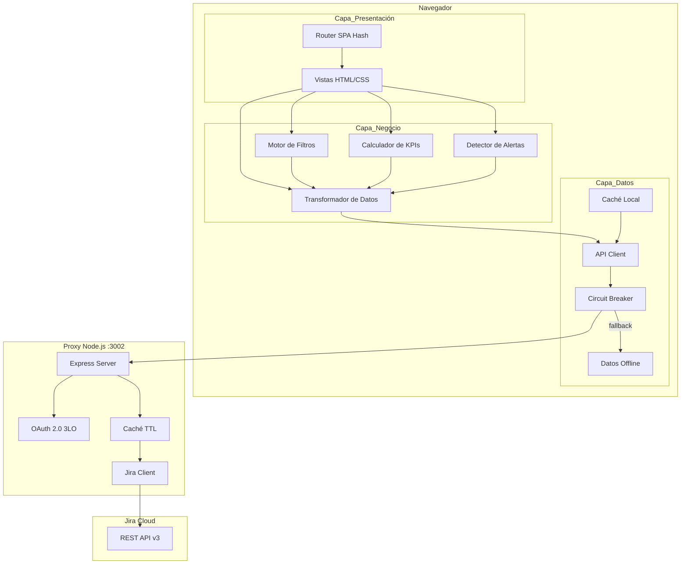
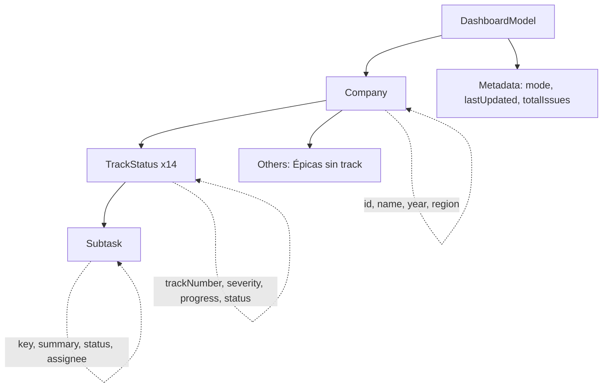
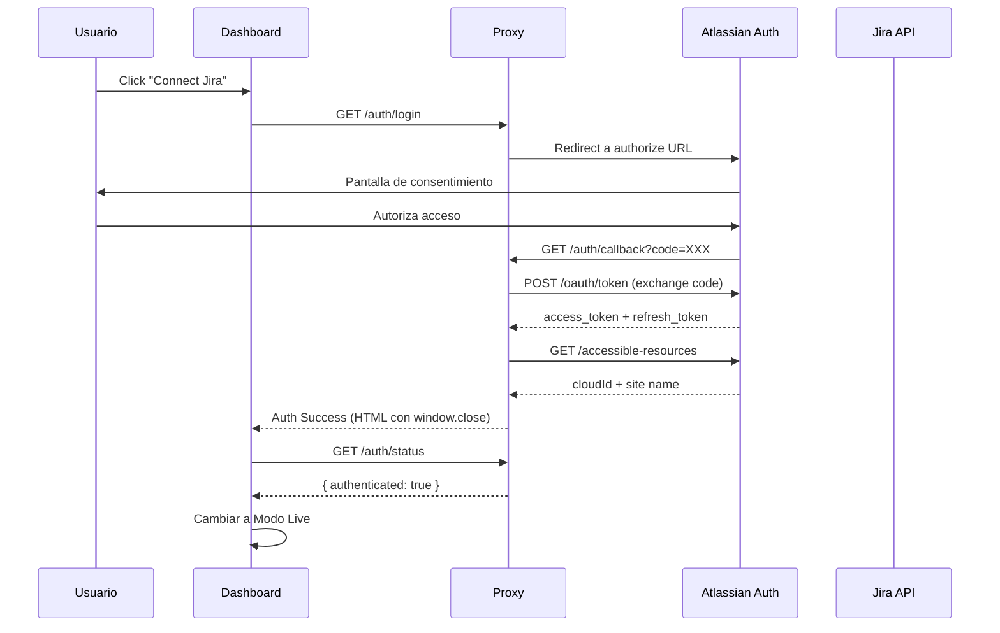
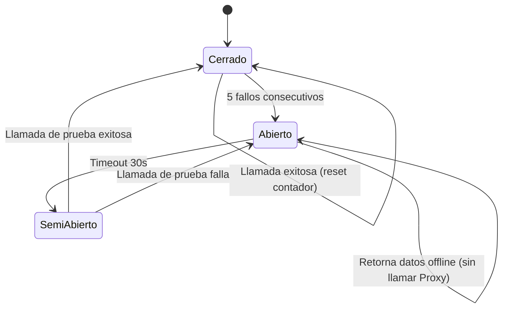
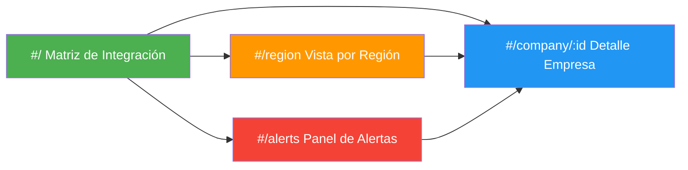
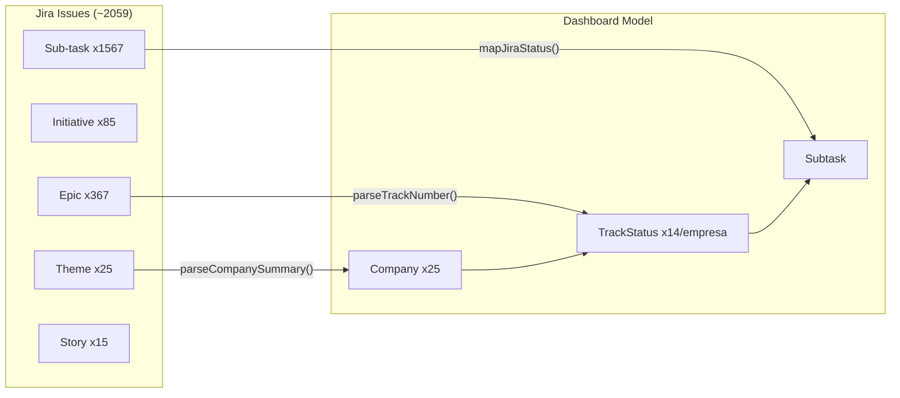
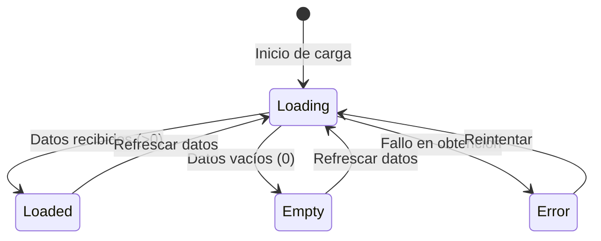
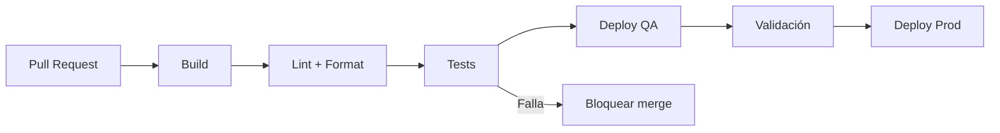

# I4G Integration Tracker — Guía del Producto

> Versión: 1.0.0 | Fecha: 2026-03-30 | Estado: Pre-implementación

---

## Tabla de Contenidos

1. [Visión General del Producto](#1-visión-general-del-producto)
2. [Contexto de Negocio](#2-contexto-de-negocio)
3. [Usuarios y Roles](#3-usuarios-y-roles)
4. [Funcionalidades Principales](#4-funcionalidades-principales)
5. [Arquitectura del Sistema](#5-arquitectura-del-sistema)
6. [Modelo de Datos](#6-modelo-de-datos)
7. [Integración con Jira](#7-integración-con-jira)
8. [Diagramas](#8-diagramas)
9. [Stack Tecnológico](#9-stack-tecnológico)
10. [Estructura del Proyecto](#10-estructura-del-proyecto)
11. [Ambientes y Despliegue](#11-ambientes-y-despliegue)
12. [Glosario](#12-glosario)
13. [Control de Cambios](#13-control-de-cambios)

---

## 1. Visión General del Producto

El I4G Integration Tracker Dashboard es una aplicación web que permite al equipo I4G (Integrations for Growth) de Globant visualizar y monitorear el estado de integración de las empresas adquiridas. Reemplaza el seguimiento manual por CSV/Excel con una herramienta visual, interactiva y actualizada en tiempo real.

### Problema que resuelve

El equipo I4G gestiona la integración de ~25 empresas adquiridas a través de 14 procesos (tracks) de integración. Actualmente el seguimiento se realiza manualmente con hojas de cálculo, lo que genera:

- Falta de visibilidad en tiempo real del estado de las integraciones
- Dificultad para identificar tracks críticos demorados o bloqueados
- Proceso manual y propenso a errores para generar reportes de progreso
- Imposibilidad de filtrar y segmentar datos por severidad, región o año

### Propuesta de valor

- Vista unificada del estado de todas las integraciones en una matriz interactiva
- Datos en tiempo real desde Jira Cloud (con fallback offline)
- Alertas automáticas de tracks críticos demorados
- KPIs y métricas para reportes ejecutivos
- Filtros por severidad, año, región y estado

---

## 2. Contexto de Negocio

### ¿Qué es I4G?

I4G (Integrations for Growth) es un sub-equipo dentro de G4G (Globant for Globers) que se encarga de asistir a las empresas adquiridas por Globant en su transición para integrarse a la organización.

### Proceso de Integración

Cada empresa adquirida pasa por 14 tracks de integración, cada uno con una severidad asignada:

| # | Track | Severidad | Descripción |
|---|-------|-----------|-------------|
| 01 | Kick Off Integration | Low | Contacto inicial, cuestionarios y documentación base |
| 02 | Initial Package | High | Acceso inicial a recursos esenciales (email, SAP) |
| 03 | E-mail & Drives Migration | Critical | Migración de email y almacenamiento |
| 04 | IT Experience Integration (Endpoints) | Critical | Equipamiento de dispositivos con estándares Globant |
| 05 | Application Integration | High | Evaluación y migración de aplicaciones |
| 06 | Acquired Official Site | Medium | Decisión sobre sitio web de la empresa adquirida |
| 07 | Acquired URL Address | Medium | Transferencia de dominios DNS |
| 08 | Acquired Infra IT Offices | Critical | Adecuación de oficinas a estándares Globant |
| 09 | Acquired Infra IT DCs | Critical | Transferencia de datacenters y cloud |
| 10 | Building Security | Medium | Transferencia de sistemas de seguridad física |
| 11 | Communication Tools | Medium | Integración a Slack corporativo |
| 12 | Compliance | High | Transferencia de certificaciones |
| 13 | Closure Review & Validate Documentation | Low | Revisión y validación de documentación |
| 14 | Closure Assets Decommissioning | Low | Decomisión final de activos |

### Regiones y Responsables

Las empresas adquiridas se agrupan en dos regiones principales:

| Región | ITX Managers |
|--------|-------------|
| Americas | Daniel Rico, Alejandra Sierra, Guilherme Braun, Matias Olivera, Ana Figuls |
| EMEA & New Markets | Leena Kurup, Ezequiel Pelletieri |

---

## 3. Usuarios y Roles

| Rol | Descripción | Uso principal |
|-----|-------------|---------------|
| Miembro del equipo I4G | Ejecuta y da seguimiento a las integraciones | Matriz de integración, vista de detalle, filtros |
| Líder del equipo I4G | Reporta progreso y toma decisiones de priorización | KPIs, alertas de tracks demorados, reportes |
| ITX Manager | Responsable regional de infraestructura IT | Vista por región, seguimiento de empresas asignadas |
| Auditor | Verifica trazabilidad y cumplimiento | Trazabilidad punta a punta |

---

## 4. Funcionalidades Principales

### 4.1 Matriz de Integración (Vista Principal)

Tabla interactiva de Empresas × Tracks con celdas coloreadas por estado:
- Gris: No iniciado (0%)
- Azul: En progreso (1-99%)
- Verde: Completado (100%)
- Rojo: Bloqueado

Incluye tooltips al hover, expansión de filas al click, y ordenamiento por año descendente.

### 4.2 Filtros y Segmentación

Filtros combinables con lógica AND:
- Severidad: Critical, High, Medium, Low
- Año de adquisición (opciones dinámicas)
- Región: Americas, EMEA & New Markets
- Estado: No Iniciado, En Progreso, Completado, Bloqueado

### 4.3 Panel de KPIs

Métricas en la parte superior:
- Total de empresas activas
- Porcentaje de completitud global
- Tracks bloqueados
- Tracks críticos en progreso
- Tabla resumen por año y severidad
- Gráfico de barras por severidad

### 4.4 Vista de Detalle por Empresa

Detalle de los 14 tracks con barras de progreso, lista de subtareas expandible, y resaltado de subtareas bloqueadas.

### 4.5 Vista por Región

Empresas agrupadas por región con separadores visuales, nombre del ITX Manager, y métricas agregadas por región.

### 4.6 Alertas de Tracks Críticos

Identificación automática de tracks Critical/High con subtareas Blocked o Reopened. Panel de alertas con navegación directa al detalle.

### 4.7 Modo Live/Offline

- Live: Datos en tiempo real desde Jira vía proxy OAuth 2.0
- Offline: Datos hardcodeados como fallback (inicio por defecto)
- Transición automática con indicadores visuales

---

## 5. Arquitectura del Sistema

### Diagrama de Arquitectura



### Capas del Sistema

| Capa | Responsabilidad | Ubicación |
|------|----------------|-----------|
| Presentación | Renderizado de vistas, interacción con usuario, gestión de estado UI | `js/presentation/` |
| Negocio | Transformación de datos, cálculo de métricas, filtrado, reglas de negocio | `js/business/` |
| Datos | Obtención de datos, caché, comunicación con Proxy, fallback offline | `js/data/` |

Principio clave: no hay dependencias directas entre Capa_Datos y Capa_Presentación.

### Patrones de Resiliencia

- Circuit Breaker: Se abre tras 5 fallos consecutivos, fallback a datos offline, reset cada 30s
- Retry: 3 intentos con backoff exponencial (1s, 2s, 4s)
- Degradación elegante: Modo offline automático cuando el proxy no está disponible

---

## 6. Modelo de Datos

### Modelo Jerárquico del Dashboard



### Entidades Principales

| Entidad | Campos clave | Origen |
|---------|-------------|--------|
| Company | id, name, year, region, tracks[] | Theme de Jira |
| TrackStatus | trackNumber (1-14), severity, progress (0-100), status, subtasks[] | Epic de Jira |
| Subtask | key, summary, status, assignee | Sub-task de Jira |
| Alert | companyId, trackNumber, severity, blockingSubtask | Calculado |
| KPIData | totalActiveCompanies, globalCompletionPercent, blockedTracksCount | Calculado |
| FilterState | severity, year, region, status (todos nullable) | UI |

### Mapeo de Estados

| Estado Jira | Estado Dashboard |
|-------------|-----------------|
| Closed | Completado |
| In Progress, Analyzing, Solution In Progress | En Progreso |
| Open, Backlog | No Iniciado |
| Blocked | Bloqueado |
| Rejected, Reopened | Rechazado |

---

## 7. Integración con Jira

### Jerarquía de Issues en Jira

```
Theme (25)           → Empresa adquirida (ej: "Omni Pro - 2025")
  └─ Initiative (85) → Plan de integración IST&SEC
       └─ Story (15) → Tareas de trabajo adicionales
  └─ Epic (367)      → Tracks del proceso (ej: "03. E-mail & Drives Migration")
       └─ Sub-task (1567) → Pasos dentro de cada track
```

Total: ~2059 issues | Proyectos: G4G (Themes, Initiatives, Stories), GLO586 (Epics, Sub-tasks)

### Autenticación

OAuth 2.0 (3LO) con Jira Cloud a través del Proxy Node.js en puerto 3002. El proxy maneja tokens, refresh automático, y paginación.

### Endpoints del Proxy

| Endpoint | Método | Descripción |
|----------|--------|-------------|
| `/auth/login` | GET | Inicia flujo OAuth 2.0 |
| `/auth/callback` | GET | Callback de autorización |
| `/auth/status` | GET | Estado de autenticación |
| `/auth/logout` | GET | Cierra sesión |
| `/api/raw` | GET | Issues crudos de Jira (con caché TTL) |
| `/api/summary` | GET | Issues agrupados por tipo |
| `/health` | GET | Health check del proxy |

### Reglas de Transformación

1. Theme → Company: Extraer nombre y año del summary con patrón `"[Nombre] - [Año]"`
2. Epic → TrackStatus: Extraer número de track del prefijo `"XX."` del summary (01-14)
3. Sub-task → Subtask: Agrupar bajo el Epic padre, mapear estado
4. Progreso: `(subtareas cerradas / total subtareas) × 100`
5. Estado del track: Bloqueado > Completado > En Progreso > No Iniciado

---

## 8. Diagramas

### 8.1 Flujo de Datos Principal

```mermaid
sequenceDiagram
    participant U as Usuario
    participant D as Dashboard
    participant P as Proxy :3002
    participant J as Jira Cloud

    U->>D: Abre Dashboard
    D->>D: Carga Modo Offline (datos hardcodeados)
    D->>D: Renderiza Matriz de Integración

    U->>D: Click "Connect Jira"
    D->>P: GET /auth/login
    P->>J: OAuth 2.0 Authorization
    J-->>P: Authorization Code
    P->>J: Exchange Code → Tokens
    P-->>D: Auth Success

    D->>P: GET /api/raw
    P->>J: POST /search/jql (paginado)
    J-->>P: Issues (~2059)
    P-->>D: JSON Issues

    D->>D: Transformar → Modelo Jerárquico
    D->>D: Calcular KPIs, Alertas
    D->>D: Re-renderizar con datos Live
```



### 8.2 Flujo de Autenticación OAuth 2.0



### 8.3 Flujo de Circuit Breaker



### 8.4 Diagrama de Navegación



### 8.5 Diagrama de Transformación de Datos



### 8.6 Máquina de Estados de Vista



---

## 9. Stack Tecnológico

| Componente | Tecnología | Justificación |
|-----------|-----------|---------------|
| Dashboard | HTML/CSS/JS vanilla | Bundle mínimo, FCP < 3s, dominio acotado |
| Proxy | Node.js + Express | Ya existente, resuelve OAuth y paginación |
| Estilos | CSS Custom Properties | Modo oscuro nativo, sin dependencias |
| Routing | Hash-based SPA | Sin servidor, compatible con hosting estático |
| Testing | Vitest + fast-check | Velocidad + property-based testing |
| CI/CD | GitHub Actions (planificado) | Integración con el repositorio |

### Decisiones de Diseño Clave

| Decisión | Alternativas consideradas | Justificación |
|----------|--------------------------|---------------|
| Vanilla JS | React, Vue, Svelte | Bundle mínimo, FCP < 3s, ~2059 issues no requiere framework |
| 3 capas en cliente | MVC, Flux | Separación clara para testabilidad sin overhead |
| CSS Custom Properties | Sass, Tailwind | Soporte nativo de temas sin build step |
| fast-check | jqwik, Hypothesis | Librería PBT más madura del ecosistema JS |
| Hash routing | History API | Compatible con hosting estático sin configuración de servidor |

---

## 10. Estructura del Proyecto

```
/
├── index.html                      # Entry point
├── css/
│   ├── tokens.css                  # Design tokens (colores, tipografía, espaciado)
│   ├── base.css                    # Reset, tipografía base, utilidades
│   ├── components.css              # Estilos de componentes reutilizables
│   ├── layout.css                  # Grid, header, navegación
│   ├── views.css                   # Estilos específicos por vista
│   ├── dark.css                    # Override tokens para modo oscuro
│   └── print.css                   # Hoja de impresión A4
├── js/
│   ├── constants.js                # Tracks, mapeos, configuración
│   ├── app.js                      # Bootstrap, inicialización, event bus
│   ├── data/
│   │   ├── api-client.js           # HTTP client con retry + circuit breaker
│   │   ├── offline-data.js         # Datos hardcodeados de fallback
│   │   └── cache.js                # Caché en memoria con TTL
│   ├── business/
│   │   ├── transformer.js          # Jira raw → Modelo jerárquico
│   │   ├── filters.js              # Motor de filtros AND
│   │   ├── kpis.js                 # Cálculo de métricas y KPIs
│   │   └── alerts.js               # Detección de tracks demorados
│   └── presentation/
│       ├── router.js               # Hash-based routing
│       ├── matrix-view.js          # Vista Matriz de Integración
│       ├── region-view.js          # Vista por Región
│       ├── detail-view.js          # Vista de Detalle por Empresa
│       ├── alerts-view.js          # Panel de Alertas
│       ├── kpi-panel.js            # Panel de KPIs y gráficos
│       ├── header.js               # Header con estado de conexión
│       └── components.js           # Componentes reutilizables
├── tests/
│   ├── unit/                       # Tests unitarios
│   ├── property/                   # Property-based tests (fast-check)
│   └── integration/                # Tests de integración
├── proxy/                          # Proxy Node.js (existente)
│   ├── server.js
│   ├── auth.js
│   ├── jira-client.js
│   └── package.json
├── docs/
│   ├── product-guide.md            # Esta guía
│   ├── i4g-process.md              # Proceso de integración I4G
│   ├── ideas.md                    # Ideas y mejoras
│   └── jira-hierarchy.md           # Jerarquía de issues en Jira
└── .kiro/
    ├── specs/i4g-integration-tracker/
    │   ├── requirements.md         # 18 requerimientos
    │   ├── design.md               # Diseño técnico
    │   └── tasks.md                # Plan de implementación
    └── agents/                     # Agentes custom (business, dev, QA)
```

---

## 11. Ambientes y Despliegue

### Ambientes Planificados

| Ambiente | Propósito | Datos |
|----------|-----------|-------|
| Local (dev) | Desarrollo y testing | Datos offline hardcodeados o Jira real vía proxy local |
| QA | Validación pre-producción | Datos de prueba representativos |
| Producción | Uso por el equipo I4G | Datos reales de Jira Cloud |

### Pipeline CI/CD (Planificado)



Etapas: build → lint (ESLint) → format (Prettier) → tests unitarios → tests property → tests integración → deploy

---

## 12. Glosario

### Términos de Negocio

| Término | Definición |
|---------|-----------|
| I4G | Integrations for Growth — sub-equipo de G4G encargado de integrar empresas adquiridas |
| G4G | Globant for Globers — área de Globant que gestiona servicios internos |
| Track | Cada uno de los 14 procesos de integración definidos por I4G |
| Empresa Adquirida | Compañía adquirida por Globant que debe pasar por el proceso de integración |
| Severidad | Nivel de criticidad de un track: Critical, High, Medium o Low |
| Región | Agrupación geográfica: Americas o EMEA & New Markets |
| ITX Manager | Responsable regional de infraestructura IT |
| IST&SEC | Infrastructure, Security & Technology — componente de integración |

### Términos de Jira

| Término | Definición |
|---------|-----------|
| Theme | Issue tipo Theme que representa una empresa adquirida (proyecto G4G) |
| Initiative | Issue tipo Initiative que representa un plan de integración IST&SEC |
| Epic | Issue tipo Epic que representa un Track del proceso (proyecto GLO586) |
| Sub-task | Issue tipo Sub-task que representa un paso dentro de un Track |
| Story | Issue tipo Story para tareas de trabajo adicionales |
| JQL | Jira Query Language — lenguaje de consulta para buscar issues |

### Términos Técnicos

| Término | Definición |
|---------|-----------|
| Dashboard | Aplicación web estática (HTML/CSS/JS) que presenta los datos de integración |
| Proxy | Servidor Node.js en `proxy/` que conecta con Jira Cloud vía OAuth 2.0 |
| Modo Live | Operación con datos en tiempo real desde Jira a través del Proxy |
| Modo Offline | Operación con datos hardcodeados como fallback |
| Circuit Breaker | Patrón que detiene llamadas a un servicio tras fallos consecutivos |
| Degradación Elegante | Capacidad de operar con funcionalidad reducida cuando un servicio falla |
| Caché TTL | Almacenamiento temporal con Time To Live configurable |
| FCP | First Contentful Paint — métrica de rendimiento de carga inicial |
| PBT | Property-Based Testing — testing con propiedades universales verificadas con inputs aleatorios |
| Design Tokens | Variables CSS que definen colores, tipografía y espaciado reutilizables |
| Modo Oscuro | Variante de interfaz con paleta invertida para reducir fatiga visual |
| SPA | Single Page Application — aplicación de una sola página con routing del lado cliente |

---

## 13. Control de Cambios

| Versión | Fecha | Autor | Descripción |
|---------|-------|-------|-------------|
| 1.0.0 | 2026-03-30 | Equipo I4G | Creación inicial del documento. Incluye visión del producto, contexto de negocio, arquitectura, modelo de datos, diagramas, stack tecnológico, glosario. Estado: pre-implementación. |

### Convención de Versionado

- **Major (X.0.0)**: Cambios significativos en la visión del producto o arquitectura
- **Minor (0.X.0)**: Nuevas funcionalidades o secciones agregadas
- **Patch (0.0.X)**: Correcciones, actualizaciones menores de contenido

### Cómo actualizar este documento

1. Agregar una entrada en la tabla de Control de Cambios con versión, fecha, autor y descripción
2. Actualizar el número de versión en el encabezado del documento
3. Si se agregan nuevos términos, incluirlos en el Glosario correspondiente
4. Commitear con mensaje: `docs: update product guide vX.Y.Z — [descripción breve]`
